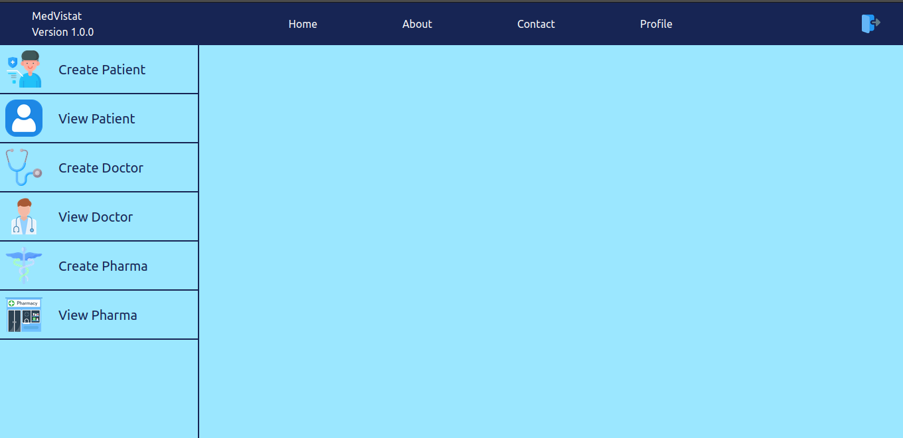
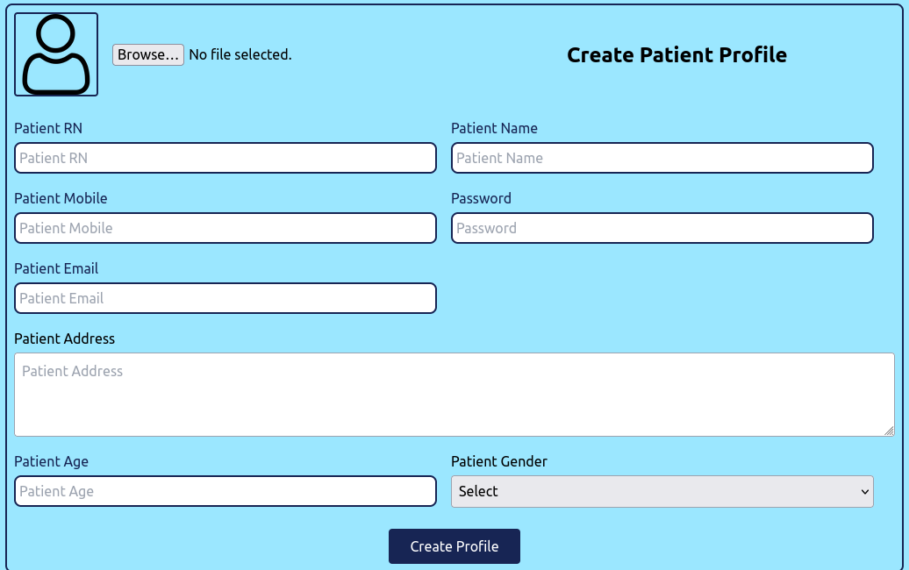
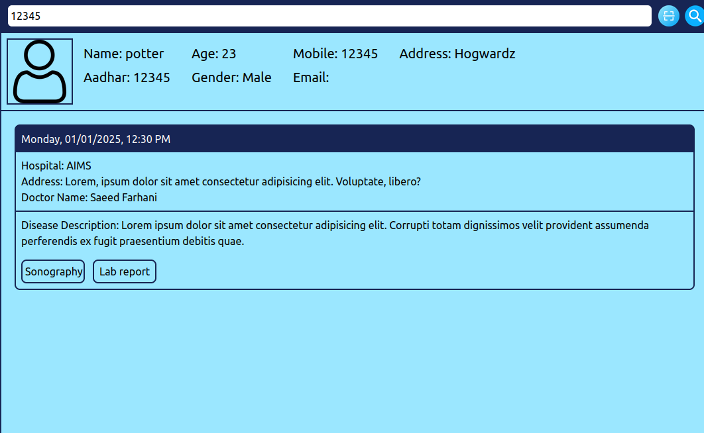

# 🏥 MedVista, Hospital Management System (MERN Stack)

A full-stack Hospital Management System where hospitals, doctors, pharmacists, and patients can manage and access medical data securely and efficiently.

## 📸 Screenshots

### 📊 Dashboard

### ➕ Create Patient Profile

### 🧾 View Patient Profile

## ✨ Features

- 👨‍⚕️ Hospital & Doctor login/signup
- 💊 Pharmacist login/signup
- 🧑‍🤝‍🧑 Patient login/signup
- 📝 Add & manage patient prescriptions
- 🧪 Upload/view lab reports, X-rays, and sonography reports
- 🔍 Doctors and pharmacists can view patient history
- 👁️ Patients can view their medical records and reports

## 🛠 Tech Stack

---

## 🔐 Authentication

- JWT-based authentication
- Role-based access: Hospital, Doctor, Pharmacist, Patient

